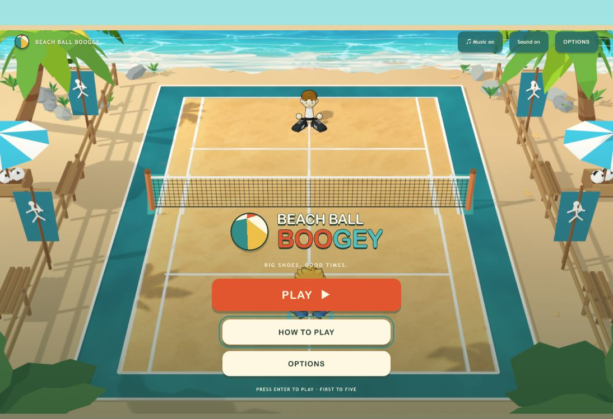
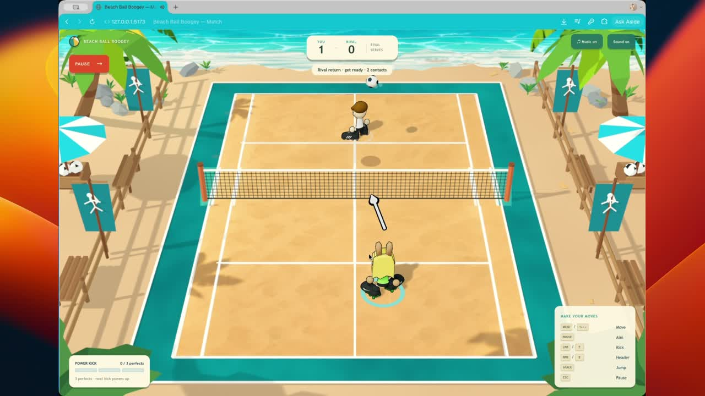
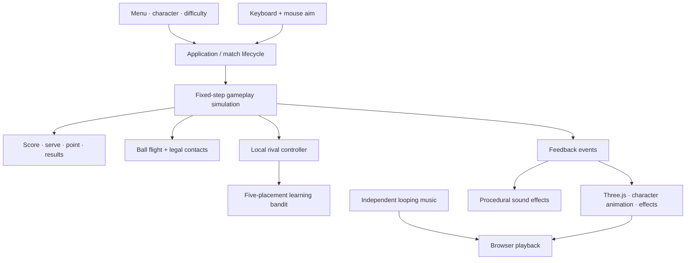

<div align="center">

# 🏖️ BEACH BALL BOOGEY
### Big shoes. Good times. One more rally.

**A tiny beach. A big-footed showdown. A rival that learns your moves.**

[](https://github.com/adityachauhan0/beachball-boogey/releases/latest)


[**🎮 DOWNLOAD & PLAY**](https://github.com/adityachauhan0/beachball-boogey/releases/latest/download/Beach-Ball-Boogey.html) · [**🎬 WATCH THE DEMO**](media/demo.mp4) · [**🛠️ BUILD IT YOURSELF**](#-bring-your-own-beach)



</div>

## ☀️ Your next five-minute holiday

Welcome to **Beach Ball Boogey**, an arcade soccer-tennis game built for a seven-hour hackathon. Pick a beach regular, lace up those enormous shoes, and send the ball sailing over the net. No hands. No teammates to blame. Just you, an increasingly suspicious rival, and a first-to-five grudge match.

- **Three ways to bring the boogie.** Sunny, Hopper, or Coco: same moves, different beach energy.
- **Pick your pace.** Easy for finding your feet, Normal for a friendly scrap, Hard for a little sand in your socks.
- **Make it airborne.** Jump, kick, head, and time your way into a powered bicycle kick.
- **A rival with a memory.** Local AI learns which placements you miss during the match. Rematch wipes the slate clean.
- **Stay for the soundtrack.** Laid-back music, punchy contact sounds, and separate top-right toggles.
- **Your beach travels with you.** The release is one offline HTML file. No account, API key, install, or game server.

## 🎬 Sixty seconds in the sun

[](media/demo.mp4)

**[▶ Watch the full gameplay demo](media/demo.mp4)** · [Download the video](https://github.com/adityachauhan0/beachball-boogey/releases/latest/download/Beach-Ball-Boogey-demo.mp4)

The preview above opens the video; GitHub does not consistently render inline video players inside README files. This is the supplied gameplay recording, compressed for the repository. The original recording is also included with the release.

## 🎮 Download. Open. Boogie.

1. Download **[Beach-Ball-Boogey.html](https://github.com/adityachauhan0/beachball-boogey/releases/latest/download/Beach-Ball-Boogey.html)** from the latest release.
2. Open the downloaded file in a modern desktop browser with WebGL enabled.
3. Press **Play → choose a player → choose difficulty → Let's Play**.

Everything is inside the file: game code, beach, character models, textures, and music. Once downloaded, it needs no network connection. Music starts after your first interaction because browsers require a gesture before playing audio. A keyboard and mouse are required; touch controls are not included.

**Prefer a ZIP?** The release also includes the same game with a short play guide, notices, and checksum. Extract it, then open the HTML file.

## 🥅 Beach rules, big shoes

**First to five wins.** Each side gets one bounce and one return per incoming shot. Hit the net, send it out, or let it bounce twice, and the other side gets the point. The loser serves next. No win-by-two; your ice cream is waiting.

| Your move | Your button |
| :--- | :--- |
| Run around your half | **WASD** or **Arrow keys** |
| Aim | **Move the mouse** |
| Kick / aerial kick | **Left click** or **F** |
| Header / jumping header | **Right click** or **E** |
| Jump | **Space** |
| Pause / resume | **Esc** |

The controls stay on screen at the bottom-right. Point into the far court to place a shot. Point around your own half to choose a hitting angle: straighter shots go deeper, angled shots spread wider. The overhead arrow shows your direction.

**Perfect timing pays off.** Three perfect returns charge the meter; your next successful kick spends that charge on a power shot. Headers can build charge, but never spend it. Rematch resets the score and the rival's learning. Pause gives you Resume, Restart, Options, and Main Menu.

**Need less motion?** Enable reduced motion in Options. Your operating system's reduced-motion preference is respected too.

## 🤖 Your rival brought a tiny brain

AI is part of the rally itself: it **moves the opponent, decides when it can return the ball, and learns where to place its next shot**. Everything runs locally in your browser, including in the offline release.

### Read the ball. Chase the bounce. Return the favour.

The rival tracks the ball's trajectory, waits through a reaction delay, and predicts a reachable interception point. It moves within its own half, attempts a legal return, then recovers toward its starting position. Contact distance, ball height, cooldown, and one-return-per-flight checks still apply. Limited speed and small targeting errors give you room to beat it with placement.

### Keep missing left? Expect more left.

The shot selector learns across **five placements: centre, left, right, short, and deep**. It keeps a small scorecard of attempts and successful outcomes for each placement. If an actual rival return bounces twice on your side, that placement earns a success. Returning it prevents that success; rival net/out shots count as failures. Opening serves do not train the scorecard.

Over the match, the rival favours placements with better estimated success while occasionally trying something else. For example, repeatedly missing deep returns can make backcourt shots more attractive to it. That is a tendency, not a guaranteed next shot: exploration and forgiving choices keep rallies varied. The between-point tactic message reflects its current preference, rather than claiming it has proven a weakness.

| Beach mood | How the AI changes |
| :--- | :--- |
| **Easy · Find your feet** | Slower reactions, narrower shots, and frequent safe centre returns. |
| **Normal · Bring your game** | Baseline reactions, wider placement, and a balance of learned choices and exploration. |
| **Hard · Make a splash** | Faster reactions, the widest placement, and more emphasis on successful learned shots. |

Movement speed stays the same across difficulties. The first two points use forgiving centre placements. Learning carries between points, but **Restart, Rematch, or a new match clears it**; no player profile is saved between matches.

Under the hood, this combines a rule-based movement controller with a lightweight **epsilon-greedy bandit using Beta(1,1) priors** for shot selection. It updates a handful of counters during play. There is **no LLM, neural-network training, cloud inference, or API key** involved. Jumping and aerial AI actions are not implemented; the rival's controller stays grounded.

## 🛠️ Bring your own beach

Requires **Node.js 20.19+ or 22.12+** and npm.

```sh
git clone https://github.com/adityachauhan0/beachball-boogey.git
cd beachball-boogey
npm ci
npm run dev
```

Open **http://127.0.0.1:5173/**. The development server uses a strict port: if it is already running, reuse it.

```sh
npm run typecheck       # TypeScript checks
npm test                # Gameplay and asset tests
npm run build           # Normal web build → dist/
npm run preview         # Preview dist/ at http://127.0.0.1:4173/
npm run release:build   # Self-contained game → release/Beach-Ball-Boogey.html
```

The standalone packager in [`scripts/package-release.mjs`](scripts/package-release.mjs) embeds the production JavaScript, CSS, GLBs, music, and attribution notices. It fails if an expected runtime asset is missing and writes a SHA-256 checksum alongside the HTML.

## 🧠 Under the beach umbrella: architecture

**TypeScript + Three.js + Vite.** The browser owns the entire game. There is no backend, remote inference, login service, or multiplayer server.



### 1. Rules live outside the renderer

[`src/game/`](src/game) contains movement, jumps, ballistics, contact windows, scoring, power, and the opponent. The application advances a fixed-step simulation and interpolates positions for rendering. Ball flight uses analytic gravity and event times for net/ground contact. Kicks and headers share receiver, distance, height, cooldown, and per-flight checks.

[`court.ts`](src/game/court.ts) is the authority for court lines, net dimensions, movement limits, and aim bounds. Those values match the authored beach scene.

### 2. The rival learns placements, not a neural network

[`opponent.ts`](src/game/opponent.ts) handles reaction, interception, return, and recovery. [`shot-learning.ts`](src/game/shot-learning.ts) selects among **centre, left, right, short, and deep** with a small epsilon-greedy bandit and Beta(1,1) priors.

A successful rival contact registers a pending shot. Its outcome is settled once when the player returns it or the rally resolves. Statistics survive point changes and reset on a fresh match. Difficulty adjusts reaction time, spread, and exploration. There are no model downloads, training services, or API calls.

### 3. Presentation follows gameplay

[`src/render/`](src/render) owns the Three.js scene, ball, effects, and character adapter. Three interchangeable skins share one rig and ten animation clips. Gameplay determines contact and jump timing; the adapter presents it. Failed character loading retains simple cube fallbacks.

The beach is retained **3D geometry with a fixed-camera appearance bake**. It uses the authored perspective camera; it is not a free-camera scene. Scenery stays static while characters, ball, and effects animate.

### 4. A small shell ties it together

[`src/main.ts`](src/main.ts) coordinates simulation, input, match state, presentation, and UI. [`src/ui/menu.ts`](src/ui/menu.ts) owns the menu flow and renders character portraits from the actual GLB. [`src/ui/music.ts`](src/ui/music.ts) handles the independently toggled background track; [`audio.ts`](src/ui/audio.ts) generates gameplay sounds.

```text
src/
├── game/       # Rules, physics, scoring, local AI and learning
├── input/      # Mouse projection and directional shot targeting
├── render/     # Three.js scene, models, animation and effects
├── ui/         # Menus, beach styling, music and sound
├── input.ts    # Keyboard state and buffered actions
└── main.ts     # Application orchestration
public/assets/  # Runtime models, beach and music
assets/blender/ # Editable source assets and export tooling
tests/          # Gameplay, rendering-contract and asset checks
scripts/        # Reproducible standalone packaging
docs/           # Design decisions, checkpoints and known limits
```

### 5. Small playgrounds for big shoes

Append `?mode=practice`, `?mode=rally`, or `?mode=movement` to isolate feeds, AI rallies, or movement. The default is a full match. Add `&debug` (or `?debug`) in development for on-screen telemetry. Production hides development telemetry.

## 🏗️ Hackathon spirit, honest edges

This is a playable hackathon release built for desktop keyboard-and-mouse play. Character fidelity, exhaustive clipping/performance checks, controlled real-window focus testing, and broader browser/device acceptance remain open. The current beach relies on its fixed camera. Gameplay balance is still a playtesting conversation, and rival learning resets between matches.

The detailed checkpoint lives in [the menu/flow handoff](docs/menu-flow-handoff.md); AI ownership and limitations live in [the Layer 7 handoff](docs/layer-7-handoff.md). Release packaging and validation are recorded in [the release handoff](docs/release-handoff.md).

## 🐚 Credits & little footprints

Built with **Three.js**, **TypeScript**, **Vite**, and **Blender**, with tests powered by **Vitest**. Small portions of the original movement/cube setup adapt MIT-licensed `Soccer_ThreeJS`; its attribution is retained in [THIRD_PARTY_NOTICES](THIRD_PARTY_NOTICES).

The beach/character artwork, soundtrack, visual references, and demo were supplied or authored during this project. The supplied music is `vintage_hawaii (4).mp3`. No blanket redistribution license for the project's original assets or music is asserted; third-party code retains its stated licenses.

---

<div align="center">

**Less scrolling. More boogie.** 🏖️⚽

[Download the game](https://github.com/adityachauhan0/beachball-boogey/releases/latest) · [Report a wonky bounce](https://github.com/adityachauhan0/beachball-boogey/issues)

</div>
